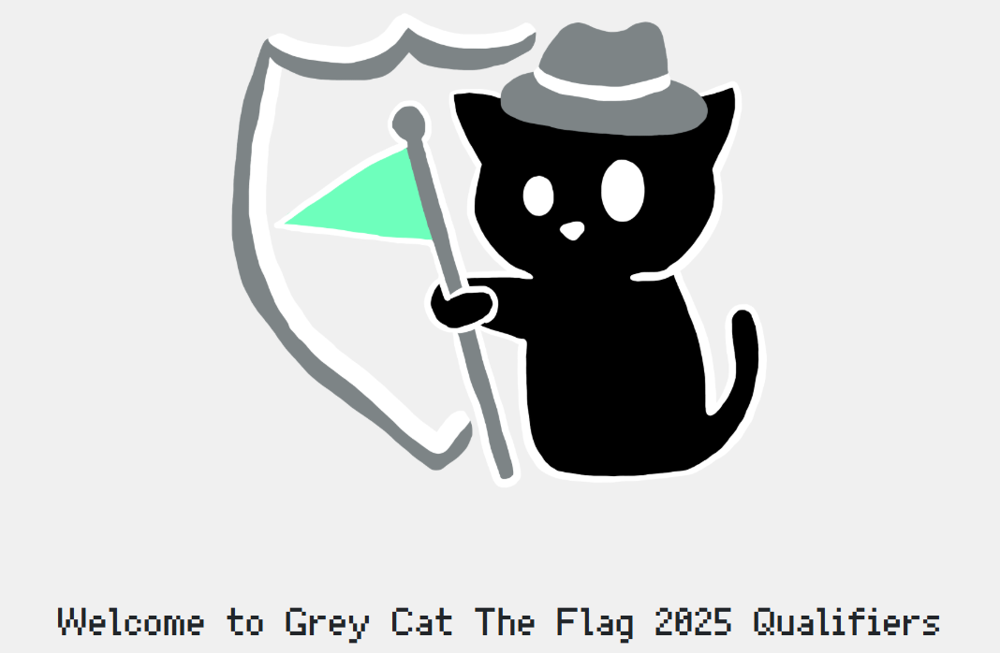

## 📚 Grey Cat The Flag CTF 2025 – Writeup & Exploit

This folder contains my personal writeups and exploit scripts for the Grey CTF 2025. The focus is on all the blockchain challenges from the event, which I successfully solved.

This was an exciting CTF experience that furthered my interest in smart contract security and blockchain hacking.

### 🧩 Challenges

| Challenge Name           | Difficulty | Writeup |
|--------------------------|------------|---------|
| Rational (11 Solves)      | Medium  | [README.md](./rational/README.md) |
| Launchpad (4 Solves)      | Hard  | [README.md](./launchpad/README.md) |

> Difficulty rating is my own estimation, as the event did not provide official difficulty levels.

### 🧰 Tools & Tech Used

- Foundry
- VSCode

### 💡 Disclaimer

All challenge code is © their original authors. This repo includes them for analysis and learning only.

If you're the author of the included challenge and would like something removed or credited differently, please reach out.

### 🔐 License

My writeups and exploit scripts are licensed under the [MIT License](../LICENSE).  

Challenge files (code) are not covered by this license.
